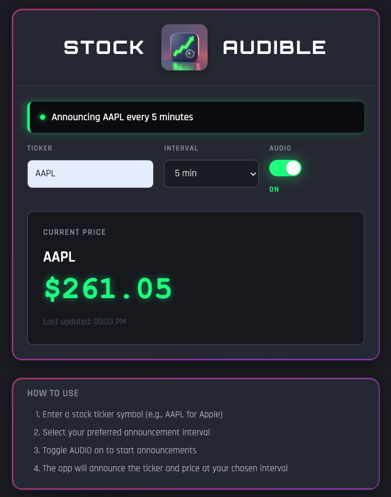

<p align="center">
  
</p>

# Stock Ticker Audio Announcer

A web application that announces stock prices at specified intervals using text-to-speech.

## Features

- Real-time stock price fetching using yfinance
- Browser-based audio announcements
- Configurable announcement intervals
- Clean, simple web interface

## Screenshot

<p align="center">
  
</p>

## Setup

1. Install dependencies:
   ```bash
   poetry install
   ```

2. Copy .env.example to .env and configure:
   ```bash
   cp .env.example .env
   ```

3. Run the application:
   ```bash
   poetry run python app.py
   ```

4. Open browser to http://localhost:5005

## Accessing from Other Devices on Your Network

The application binds to `0.0.0.0` by default, making it accessible from other devices on your local network.

1. Find your computer's local IP address:
   - **macOS/Linux**: Run `ifconfig | grep "inet "` or `hostname -I`
   - **Windows**: Run `ipconfig` and look for IPv4 Address

2. On another device (phone, tablet, another computer) connected to the same WiFi network, open a browser to:
   ```
   http://YOUR_LOCAL_IP:5005
   ```
   For example: `http://192.168.1.100:5005`

3. The audio will play on the device accessing the app, so you can have announcements on different devices throughout your home or office.

**Security Note**: This makes your app accessible to anyone on your local network. Don't expose port 5005 to the internet or use on untrusted networks.

## Usage

1. Enter a stock ticker symbol:
   - **Stocks**: Use the standard symbol (e.g., AAPL, TSLA, MSFT)
   - **ETFs/Indices**: Add a leading `^` (e.g., ^XSP, ^SPX, ^GSPC)
2. Set announcement interval in seconds (minimum 5, default 300 = 5 minutes)
3. Click "Start Announcements"
4. Listen to periodic price updates
5. Toggle audio on/off using checkbox
6. Click "Stop Announcements" when done

### Mobile Safari (iOS)

Due to iOS restrictions on programmatic audio playback, automatic announcements don't work on Mobile Safari. Instead:
- When a new price update arrives, you'll see "Tap to hear" in the display
- Tap the price display to play the announcement
- This ensures audio plays with direct user interaction, as required by iOS

Desktop browsers (Safari, Chrome, Firefox, Brave) play announcements automatically.

## Important: Shared Ticker Behavior

This application uses a **shared ticker model** - all connected browsers receive the same stock updates:

- When any browser starts announcements, all connected browsers receive those updates
- Starting a new ticker or changing the interval replaces the current ticker for all clients
- Each browser can independently enable/disable audio using the checkbox
- Think of it as a central stock price display board that multiple people can view

**Use Cases:**
- Multiple devices/screens in the same room showing the same stock
- Family members each viewing on their own device
- One person controlling the ticker, others just listening

**Note:** Per-client tracking (each browser tracking different tickers independently) could be added as a future enhancement.

## Requirements

- Python 3.10+
- Modern web browser with Web Speech API support
- Internet connection for fetching stock data

## Project Structure

```
stock-audible/
├── app.py              # Flask application with WebSocket handlers
├── config.py           # Configuration management
├── stock_service.py    # Stock data fetching logic
├── templates/
│   └── index.html      # Web UI
└── static/
    ├── css/
    │   └── style.css   # Styling
    └── js/
        └── app.js      # Frontend logic + TTS
```
